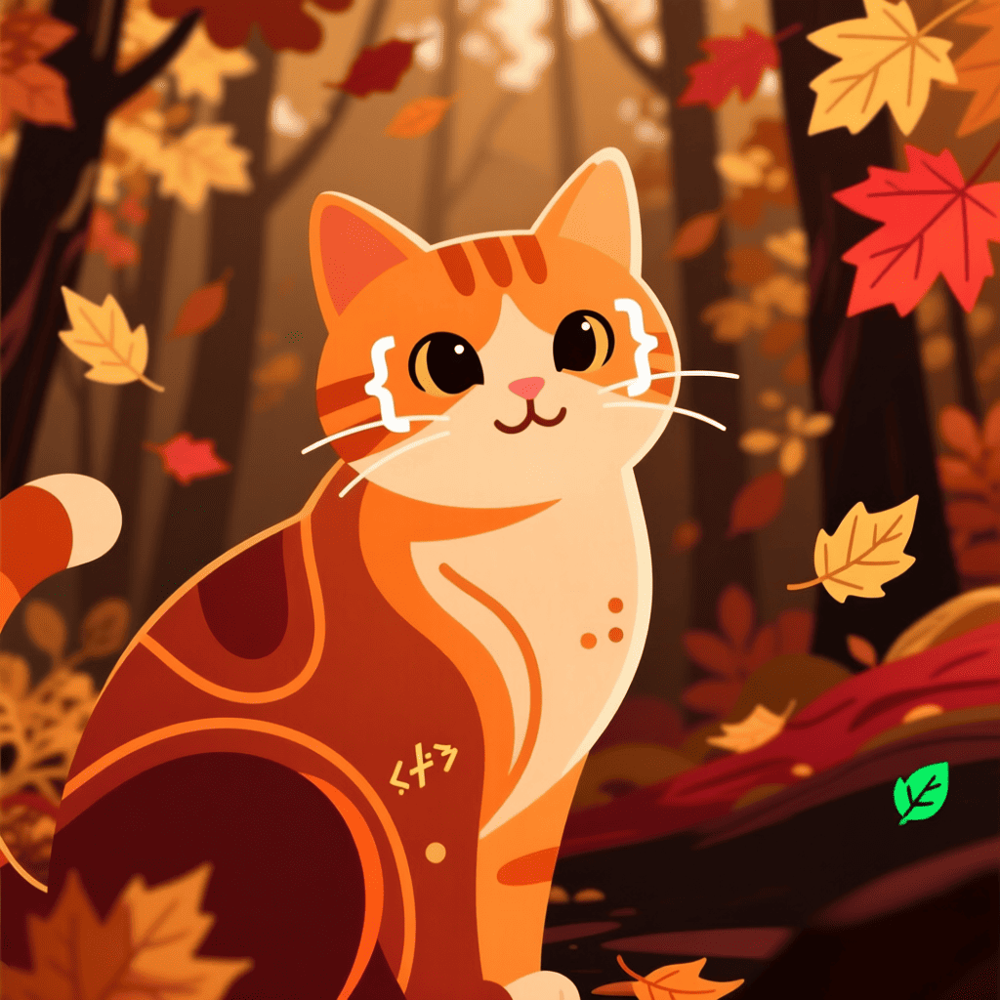

<p align="center">
	
</p>

<h1 align="center">
	JSON форматирование с котиками и HTMX
</h1>

## Технологии

<p align="center">
  
  
  
  
</p>

## Старт

### Требования

- Docker
- Docker Compose

### Запуск

```bash
# Клонирование репозитория
git clone https://github.com/vnkot/json-kitty
cd json-kitty

# Запуск в режиме разработки
make up-dev

# Запуск в режиме продакшена (перед этим в кадди поменяйте на свой домен или укажите localhost)
make up-prod
```
